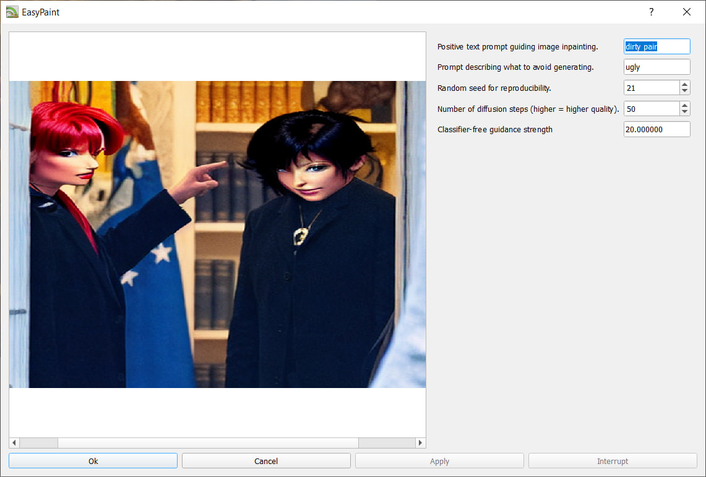
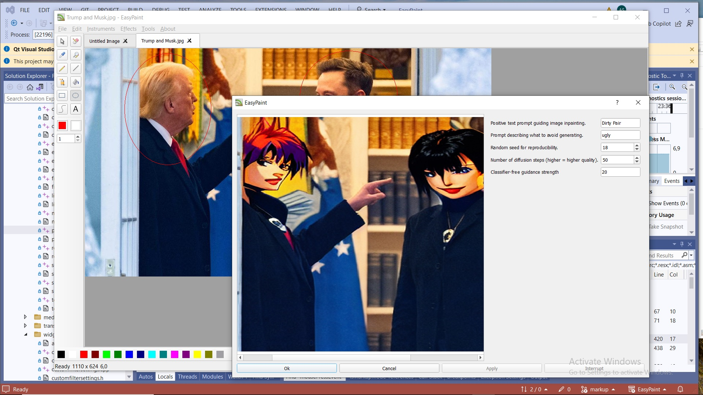

EasyPaint
=========

EasyPaint is a simple graphics painting program.

EasyPaint is a part of QtDesktop project.

EasyPaint is a part of [Razor-qt's](https://github.com/Razor-qt) [3rd party applications](https://github.com/Razor-qt/razor-qt/wiki/3rd-party-applications).

Installing
----------

Install EasyPaint using the commands, if you use CMake:

    cd ./EasyPaint
    cmake -DCMAKE_INSTALL_PREFIX=/usr
    make
    make install

Install EasyPaint using the commands, if you use qmake:

    cd ./EasyPaint/sources
    lrelease easypaint.pro
    qmake
    make
    make install

License
-------

EasyPaint is distributed under the [MIT license](http://www.opensource.org/licenses/MIT).

Python scripting
----------------

Enable Instruments -> Markup mode to use markup:

