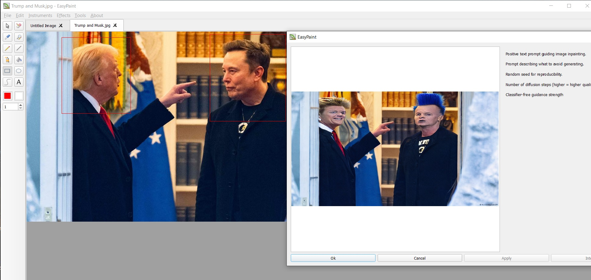

EasyPaint
=========

EasyPaint is a simple graphics painting program.

EasyPaint is a part of QtDesktop project.

EasyPaint is a part of [Razor-qt's](https://github.com/Razor-qt) [3rd party applications](https://github.com/Razor-qt/razor-qt/wiki/3rd-party-applications).

Installing
----------

Install EasyPaint using the commands, if you use CMake:

    cd ./EasyPaint
    cmake -DCMAKE_INSTALL_PREFIX=/usr
    make
    make install

License
-------

EasyPaint is distributed under the [MIT license](http://www.opensource.org/licenses/MIT).

Python scripting
----------------

Users can write Python functions that are automatically exposed in the app’s menus once loaded.

## Getting Started
### 1. Install / Build

Windows: Unzip the prebuilt package.

Linux/macOS: Build the application from source.

### 2. Python Setup

Ensure the corresponding version of Python is installed.

(Optional but recommended) Create a virtual environment for dependencies:

    python -m venv venv
    source venv/bin/activate   # Linux/macOS
    venv\Scripts\activate      # Windows

### 3. Install Dependencies

Use the provided requirements.txt to install extra libraries (e.g., Hugging Face, OpenCV):

pip install -r requirements.txt

### 4. Writing Scripts

Place your Python scripts in the designated directory.

Functions without a leading underscore (e.g., def my_tool():) will be exposed in the application’s menus when the script loads successfully.

Scripts can leverage all installed Python libraries.

- ✅ Cross-platform (Windows, Linux, macOS)
- ✅ Extensible via Python
- ✅ Supports external libs (Hugging Face, OpenCV, etc.)

## Python Scripts Overview

These Python scripts extend the paint application with **image generation, transformation, and enhancement features**.  
See scripts folder for examples.

---

### `depth2img.py`
This script focuses on **depth-guided image transformation**. It transforms images using depth maps to maintain scene geometry.

- **Functions**
  - `generate_depth_image` — Transforms an image based on depth information, preserving scene structure.

---

### `img2img.py`
This script supports **image-to-image translation**, transforming an existing picture while keeping its overall structure.

- **Functions**
  - `generate_img2img` — Produces a modified version of an input image while maintaining its overall structure.

**Key Technical Differences**
=============================

1\. **Model architecture**
--------------------------

### img2img.py

Uses **SD 1.5 img2img**, which:

*   Adds noise according to strength
    
*   Re-generates the image guided by the prompt➡️ **No understanding of scene depth**.➡️ Geometry/sizes may drift or distort.
    

### depth2img.py

Uses **SD2 depth-guided diffusion**, where the model gets:

*   The RGB image
    
*   A predicted **depth map**
    
*   The prompt
    

➡️ Much stronger preservation of layout and shapes➡️ Camera angle, perspective, object proportions remain stable

2\. **Capabilities**
--------------------

### **img2img — what it’s good at**

✔ Style transfer✔ Recoloring, mood changes✔ Artistic transformations✔ Turning sketches into paintings✔ Significant prompt-driven changes (faces, objects, lighting)✖ Geometry preservation is weak✖ Objects may shift or deform✖ Hard for realism with strict constraints

### **depth2img — what it's good at**

✔ Structure-preserving realism✔ Maintaining perspective, edges, contours✔ Photo → enhanced photo✔ Background replacement with stable foreground✔ Consistent character/object shape✔ Keeping hands, body positions, architecture stable✖ Less flexible for wild artistic transformations✖ More literal to original image

3\. **Quality / Visual Differences**
------------------------------------

### img2img output tends to:

*   Drift away from the original image at higher strengths
    
*   Change shapes, edges, even composition
    
*   Be more creative (good or bad)
    

### depth2img output tends to:

*   Stay loyal to the original layout
    
*   Preserve contours, buildings, bodies
    
*   Produce realism with stable object boundaries
    
*   Allow big _semantic_ changes while preserving geometry
    

4\. **Strength parameter differences**
--------------------------------------

### In img2img:

strength = how much noise is added

*   0.1 → slight stylization
    
*   0.5 → strong change
    
*   0.9 → almost full re-generation
    

### In depth2img:

Depth condition provides stability even with high strength

*   0.1 → mild color/stylistic tweaks
    
*   0.5 → significant transformation but geometry kept
    
*   0.9 → still retains shapes better than img2img
    

5\. **Underlying Model Versions**
---------------------------------

### img2img.py → **Stable Diffusion 1.5**

*   Better for stylization
    
*   Less realistic
    
*   More artifacts
    
*   Weaker at human anatomy
    

### depth2img.py → **Stable Diffusion 2.0–depth**

*   Better depth understanding
    
*   Realistic rendering
    
*   Much more stable human shapes
    
*   Preserves backgrounds and structure
    

🧠 **Summary: When to choose which?**
=====================================

### Use **img2img.py** if:

*   You want creative variation
    
*   You want to heavily stylize or reimagine
    
*   You want surreal / artistic transformations
    
*   You don't need strict preservation of shapes
    

### Use **depth2img.py** if:

*   You want to keep the geometry
    
*   You want realistic or photographic edits
    
*   You want to keep perspective and composition stable
    
*   You want to change style but preserve structure
    
*   You are editing photos or production artwork
    

🚀 **Practical example**
========================

Input: photo of a building**img2img** → might reshape windows, add floors, distort lines**depth2img** → keeps building straight, only changes textures/colors
Input: portrait**img2img** → risks face changes**depth2img** → keeps same face geometry, pose, lighting

---

### `generate.py`
This script provides a **basic image generation entry point** for creating images from scratch.

- **Functions**
  - `generate_image` — Creates an image from scratch, typically using a generative model (e.g., diffusion).

---

### `inpaint.py`
This script specializes in **inpainting**, i.e., filling in missing or masked areas with contextually appropriate content.

- **Functions**
  - `predict` — Performs inpainting by filling missing or masked image areas with context-aware content.

---

### `script.py`
This script provides **general-purpose image processing and procedural generation tools**.  
It includes filtering, corrections, resizing, and fractal/texture generators.

- **Functions**
  - `denoise_image` — Reduces unwanted noise or grain in an image.  
  - `blur_image` — Applies a blur filter.  
  - `deblur_image` — Restores sharpness to a blurred image.  
  - `gamma_correct` — Adjusts brightness and contrast through gamma correction.  
  - `enhance_contrast` — Improves visibility of details by adjusting contrast.  
  - `resize_image` — Rescales an image to new dimensions.  
  - `generate_mandelbrot` — Produces a Mandelbrot fractal image.  
  - `generate_julia` — Produces a Julia set fractal image.  
  - `generate_plasma` — Creates a plasma-like procedural texture.

---

### `style_transfer.py`
This script implements **style transfer**, allowing users to apply the artistic style of one image to another.

- **Functions**
  - `set_as_style` — Selects an image as a reference style.  
  - `transfer_style` — Transfers the reference style onto another image.

Enable Instruments -> Markup mode to use markup:

